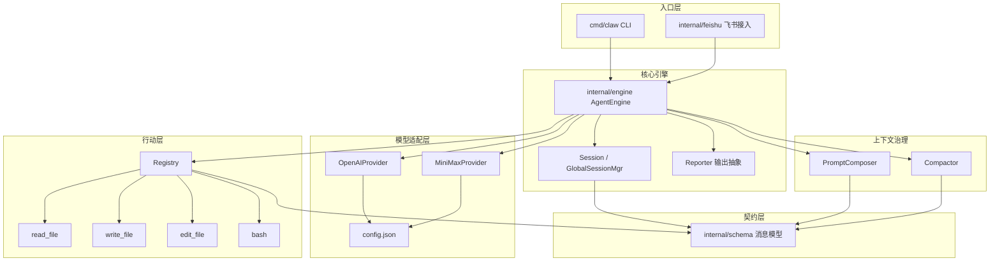

# CodeWiki-Plus-Harness — Workspace Overview

_Generated: 2026-08-29 (enriched with architectural narrative)_

## Architecture Narrative

本工作区采用 **centralized（集中式）知识布局**：业务仓 `go-my-harness` 为纯代码目录，全部知识沉淀在工作区 `repowiki/`，实现一跳检索。当前工作区仅挂载一个业务仓，因此不存在跨仓 HTTP/MQ 调用，本总览聚焦该仓内部的**分层模块架构**与知识组织方式。

go-my-harness 是一个**单进程、多入口**的 Agent 运行时：`cmd/claw`（CLI 入口）与 `internal/feishu`（飞书接入，待接入入口）共享同一套引擎与会话体系。系统遵循**供应商中立的适配器模式**——上层引擎只依赖 `LLMProvider` 接口，通过 `config.json` 的 `provider` 字段在 OpenAI 兼容适配器（DeepSeek/智谱）与 Anthropic 兼容适配器（MiniMax）之间切换，实现"一套引擎、多家模型"。

核心数据流呈**单向分层**：入口层组装（app/feishu）→ 引擎主循环（engine）→ 上下文治理（context）→ 模型适配（provider）→ 行动执行（tools），全部消息以 `internal/schema` 的纯数据结构为契约（零第三方依赖）。引擎采用**无状态设计**：`AgentEngine` 不保存历史，上下文全部由外部 `Session` 承载，以工作记忆窗口（最近 6 条）+ Compactor 双重降级（远期掩码、近期头尾截断）控制上下文成本，并支持工具并行 goroutine 执行。

## Service Topology

当前仅一个服务 `go-my-harness`，以下为其内部模块拓扑：

## Cross-Service Summary

单仓场景下无跨服务 API 调用（RouteNode 匹配为 0）。系统级协作体现为**模块间调用链**：

- **入口 → 引擎**：CLI/飞书组装 provider、registry、会话后调用 `AgentEngine.Run`；
- **引擎 → 上下文**：每次循环经 `PromptComposer.Build` 重建系统提示词、`Compactor.Compact` 压缩上下文后送交模型；
- **引擎 → 适配层**：思考阶段无工具推理，行动阶段携带工具列表调用 `LLMProvider.Generate`；
- **引擎 → 行动层**：模型返回 ToolCalls 后经 Registry 并行路由执行四个工作区工具；
- **输出抽象**：`Reporter` 接口解耦展现层（TerminalReporter / FeishuReporter 两种实现）。

## Service Directory

| Service | Path | Languages | Components | Modules Wiki | 状态 |
|---------|------|-----------|------------|--------------|------|
| go-my-harness | `go-my-harness` | go | 99 | [模块文档](./wiki/modules/go-my-harness/) | 已分析，7 个模块文档 |

### 模块文档索引

- [App 入口模块](./wiki/modules/go-my-harness/app_module.md) — CLI 与遗留演示入口
- [Context 上下文管理模块](./wiki/modules/go-my-harness/context_module.md) — 提示词组装 / 压缩 / 技能加载
- [Engine 引擎模块](./wiki/modules/go-my-harness/engine_module.md) — Agent 主循环与会话管理
- [Feishu 飞书集成模块](./wiki/modules/go-my-harness/feishu_module.md) — 飞书开放平台接入
- [Provider 模型提供商模块](./wiki/modules/go-my-harness/provider_module.md) — LLM 适配器与配置
- [Schema 数据模型模块](./wiki/modules/go-my-harness/schema_module.md) — 共享消息契约
- [Tools 工具系统模块](./wiki/modules/go-my-harness/tools_module.md) — 工具注册与执行

## Key Architectural Decisions

1. **适配器隔离 SDK**：schema 契约层零第三方依赖，provider 层双向翻译，新增模型供应商只需实现 `LLMProvider`；
2. **无状态引擎 + 外部化会话**：多端（CLI/飞书）共享引擎实例，会话按 ChatID/固定 ID 物理隔离；
3. **上下文治理前置**：工作记忆窗口 + Compactor 双重降级，Session 保存全量历史供回溯；
4. **错误即信息**：工具执行错误回传模型自愈而非中断主循环，配合 bash 30s 超时与 8000 字节截断约束资源边界；
5. **PlanMode 状态外部化**：长程任务强制写入 PLAN.md/TODO.md，进程重启后断点续传。
