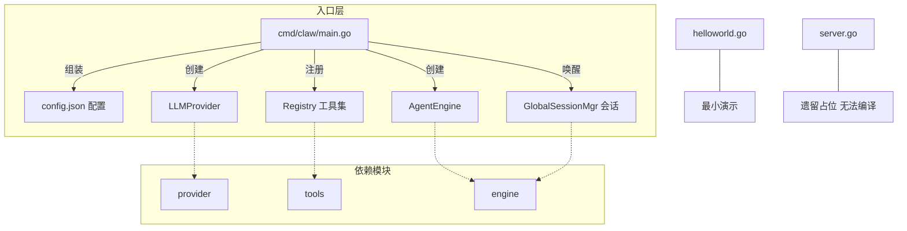
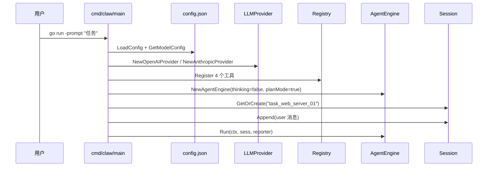

# App 入口模块

`app` 模块汇总 go-my-harness 的三个 `main` 入口。其中 `cmd/claw/main.go` 是唯一生产级入口，负责组装整个 Agent 运行时；`helloworld.go` 为最小演示；`server.go` 为遗留占位文件。

## Component Constraint Index

| Component | Constraints | Risks | Summary |
|-----------|-------------|-------|---------|
| cmd/claw/main.go::main | 3 | 2 | 组装 provider/registry/engine 并执行单轮 Agent |
| server.go::main | 1 | 2 | 遗留占位，引用未定义变量无法编译 |
| helloworld.go::main | 0 | 0 | 最小 hello world 演示 |

## Architecture Overview

三个入口并存是项目演进留下的痕迹：`cmd/claw` 是持续演化的主入口（第 13 讲实战产物），根目录的 `server.go` 与 `helloworld.go` 是早期教学/演示文件，未随架构演进清理。

## Component Responsibilities

### cmd/claw/main.go::main — CLI 主入口

这是系统真正的启动路径，执行完整的 Agent 组装与唤醒流程：

1. **参数解析**：通过 `flag` 包读取 `-prompt` 参数，为空则打印用法并退出；
2. **配置加载**：基于当前工作目录定位 `config.json`，调用 `provider.LoadConfig` 加载应用配置，再用 `cfg.GetModelConfig("")` 取默认模型配置；
3. **Provider 选择**：按 `mc.Provider` 字段分流——`openai` → `NewOpenAIProvider`，`anthropic` → `NewAnthropicProvider`，其余值直接 `log.Fatalf` 退出；
4. **工具注册**：`tools.NewRegistry()` 创建注册表，注册 `read_file` / `write_file` / `bash` / `edit_file` 四个工具，工作区锁定为项目根目录；
5. **引擎组装**：`engine.NewAgentEngine(llmProvider, registry, false, true)` —— 关闭慢思考（追求演示效果）、开启 PlanMode；
6. **会话唤醒**：使用固定会话 ID `task_web_server_01` 从 `GlobalSessionMgr` 取会话，将 `-prompt` 内容作为 `RoleUser` 消息追加，最后调用 `eng.Run` 执行 Agent 循环。

关键设计：会话 ID 硬编码为 `task_web_server_01`，意味着多次进程唤醒共享同一 [Session](../../../internal/engine/session.go) 历史（配合 PlanMode 的 PLAN.md/TODO.md 外部化实现断点续传），但 CLI 单用户场景下无并发冲突。

### server.go::main — 遗留占位

声称启动 8080 端口的 HTTP 服务器，并计划增加鉴权逻辑，但代码引用了未定义的 `user` 变量（`if user == nil`），**当前无法编译通过**。该文件是早期阶段的占位草稿，不应被视为可运行服务。

### helloworld.go::main — 最小演示

仅打印 `Hello, go-my-harness!`，用于验证模块导入链与构建链路的最小示例。

## Data Flow

## API Contracts

- **CLI 接口**：`go run cmd/claw/main.go -prompt "<任务指令>"`，`-prompt` 为必填参数；
- **配置文件**：依赖工作目录下的 `config.json`（结构见 provider 模块文档），缺失或格式错误时进程直接退出；
- **退出码**：参数缺失 / 配置错误 / provider 不支持 / 引擎崩溃均以非零码退出并打印错误。

## Cross-References

- **provider 模块**：`LoadConfig` / `GetModelConfig` / `NewOpenAIProvider` / `NewAnthropicProvider`，按配置选择模型适配器；
- **tools 模块**：注册 read_file / write_file / bash / edit_file 四件套，工作区锁定为项目根；
- **engine 模块**：`NewAgentEngine` 组装引擎，`GlobalSessionMgr` 管理会话，`TerminalReporter` 输出到终端；
- **schema 模块**：构造 `RoleUser` 消息写入会话。

## Architecture Decisions

1. **入口与引擎解耦**：main 只做组装与参数传递，不含任何业务逻辑，引擎逻辑全部下沉到 internal 包，便于多入口复用（CLI / 飞书均调用 `engine.AgentEngine.Run`）；
2. **PlanMode 作为入口级开关**：CLI 场景强制开启 PlanMode（文件系统记忆），演示了长程任务外部化范式；
3. **固定会话 ID 策略**：演示场景下复用 `task_web_server_01` 使断点续传可复现，生产化时应改为每次唤醒生成新 ID 或按用户维度命名。

## Constraints and Edge Cases

- `-prompt` 为空时拒绝启动（`os.Exit(1)`）；
- `config.json` 缺失或模型未定义时启动失败；
- `server.go` 引用未定义变量 `user`，若 `go build ./...` 会报编译错误，建议后续移除或补全；
- 引擎在 thinking 关闭 + PlanMode 开启的组合下运行，长任务依赖 PLAN.md / TODO.md 的读写，首次唤醒时由 Agent 自行创建。
