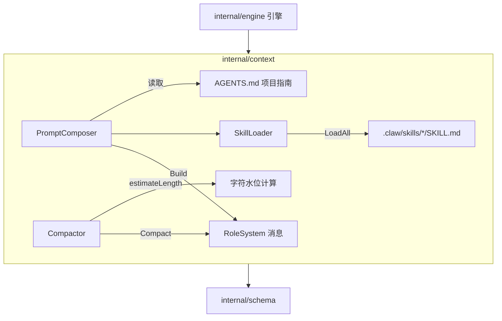
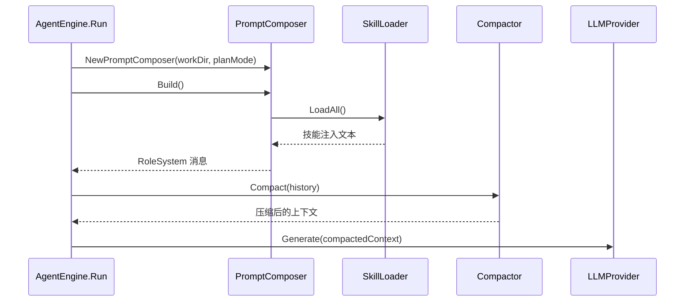

# Context 上下文管理模块

`internal/context` 负责 Agent 上下文的**组装**与**治理**：`PromptComposer` 根据工作区环境动态生成 System Prompt，`Compactor` 在上下文超限时执行双重降级压缩，`SkillLoader` 从 `.claw/skills` 加载外挂技能注入提示词。它是引擎与提示工程之间的枢纽。

## Component Constraint Index

| Component | Constraints | Risks | Summary |
|-----------|-------------|-------|---------|
| [Compactor](../../../internal/context/compactor.go).Compact | 4 | 2 | 掩码远期 + 截断近期，双重防 OOM |
| [PromptComposer](../../../internal/context/composer.go).Build | 3 | 1 | 核心身份+PlanMode+AGENTS.md+技能四段拼装 |
| [SkillLoader](../../../internal/context/skill.go).LoadAll | 2 | 1 | 扫描 SKILL.md 注入技能上下文 |
| [Compactor](../../../internal/context/compactor.go).estimateLength | 1 | 0 | 字符水位估算 |

## Architecture Overview

模块由三个无外部依赖的内部包协作：每次 `AgentEngine.Run` 都会用会话绑定的 WorkDir 重新 `NewPromptComposer` 并 `Build` 系统提示词；每轮循环发出的上下文都会先经 `Compactor.Compact` 压缩再送交 Provider。

## Component Responsibilities

### PromptComposer — 系统提示词组装器

`PromptComposer` 持有 `workDir`、`planMode`、`skillLoader` 三个字段，`Build()` 返回一条 `RoleSystem` 消息，内容按四段拼装：

1. **核心身份（Minimal Core）**：固定文本，确立“go-my-harness”骨灰级研发助手身份与 6 条核心纪律（检查文件用 bash、建文件用 write_file、编辑前先读、报错先读 stderr 自修、始终中文回复等）；
2. **长程任务与状态外部化强制规范（Plan Mode ON）**：仅在 `planMode=true` 时追加，强制 Agent 遵循 STEP 1（环境嗅探 PLAN.md/TODO.md）→ STEP 2（单步执行实时打勾）→ STEP 3（迷失自救）的绝对顺序；
3. **项目专属指南**：若工作区存在 `AGENTS.md` 则全文注入，约束 Agent 遵循项目特有架构规范；
4. **动态技能**：`skillLoader.LoadAll()` 返回的技能文本，非空时追加。

### Compactor — 上下文压缩器

`Compactor` 由两个参数控制：`MaxChars`（水位线，默认 200000）与 `RetainLastMsgs`（工作记忆保护区，默认 6）。`Compact()` 逻辑：

- 总长度未超水位线 → 原样返回（大多数情况正常路径）；
- 超限后逐条处理：**system 消息绝对保留**；对远期历史（保护区之外）的 `user+ToolCallID` 工具结果，若单条超 200 字符则**全量掩码**为清理占位；对近期保护区的超大工具结果（>1000 字符）执行**头尾截断**（保留前 500 + 后 500 字符）；对远期 assistant 冗长推理（>200 字符）折叠为占位；
- **绝不触碰 `msg.ToolCalls`**——工具调用是模型行动的证据，是维系逻辑链的关键；
- 压缩时对消息做**拷贝而非原地修改**，避免并发环境下污染 [Session](../../../internal/engine/session.go) 中的原始数据。

`estimateLength()` 粗略计算总字符长度：`Content` 长度 + 每个 `ToolCall` 的 `Name` 与 `Arguments` 长度之和。

### SkillLoader — 技能加载器

`SkillLoader.LoadAll()` 扫描 `workDir/.claw/skills` 目录（不存在则静默返回空），递归查找所有 `SKILL.md`，经 `parseSkillMD` 解析为 `Skill{Name, Description, Body}` 结构后按“技能名称 / 触发条件 / 执行指南”格式注入提示词。`parseSkillMD` 采用极简 frontmatter 解析：以 `---` 分三段提取 `name:` 与 `description:` 字段，其余全部作为正文。

## Data Flow

## API Contracts

- `NewPromptComposer(workDir string, planMode bool) *PromptComposer`
- `(*PromptComposer).Build() schema.Message` — 返回 `Role=RoleSystem` 的消息
- `NewCompactor(maxChars int, retainLastMsgs int) *Compactor`
- `(*Compactor).Compact(msgs []schema.Message) []schema.Message` — 返回新切片，不修改入参
- `NewSkillLoader(workDir string) *SkillLoader`；`(*SkillLoader).LoadAll() string`

## Cross-References

- **engine 模块**：`AgentEngine` 在 `Run` 时用 `session.WorkDir` 重建 composer，并把 `compactor` 用于每轮循环的上下文压缩；
- **schema 模块**：`Compact` 依赖 `Message.Role` / `ToolCallID` / `ToolCalls` 判定消息类型；`Build` 返回 `RoleSystem` 消息；
- **app 模块**：CLI 入口以 `planMode=true` 创建引擎，使 Plan Mode 段落生效；
- **feishu 模块**：飞书会话同样复用 `session.WorkDir`，因此 PlanMode 文件（PLAN.md/TODO.md）落在各会话绑定的工作区。

## Architecture Decisions

1. **上下文治理前置**：压缩在引擎侧统一执行，[Session](../../../internal/engine/session.go) 保存全量原始数据供回溯，实现“发往模型的是压缩视图，本地是全量历史”；
2. **双重降级防线**：远期掩码 + 近期截断的分层策略兼顾长程记忆保持与短程信息保全；
3. **提示词动态化**：AGENTS.md 与 Skills 均在运行时注入，避免将项目规范硬编码进引擎；
4. **默认参数经验值**：水位线 200000 字符与保护区 6 条为演示调参结果，生产环境应结合模型 token 窗口重新标定。

## Constraints and Edge Cases

- `parseSkillMD` 依赖 frontmatter 以 `---` 开头，非标准格式的技能文件会退化为 `Body=全文`；
- `Compact` 对 `ToolCalls` 只读不压缩，极端场景下大量工具调用仍可能撑大上下文；
- PlanMode 规范是提示词层面的软约束，依赖模型遵循，缺少硬性检查；
- 技能目录无内容或全部解析失败时 `LoadAll` 返回空字符串，`Build` 自动跳过该段。
