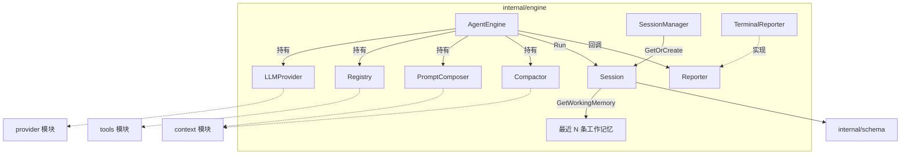
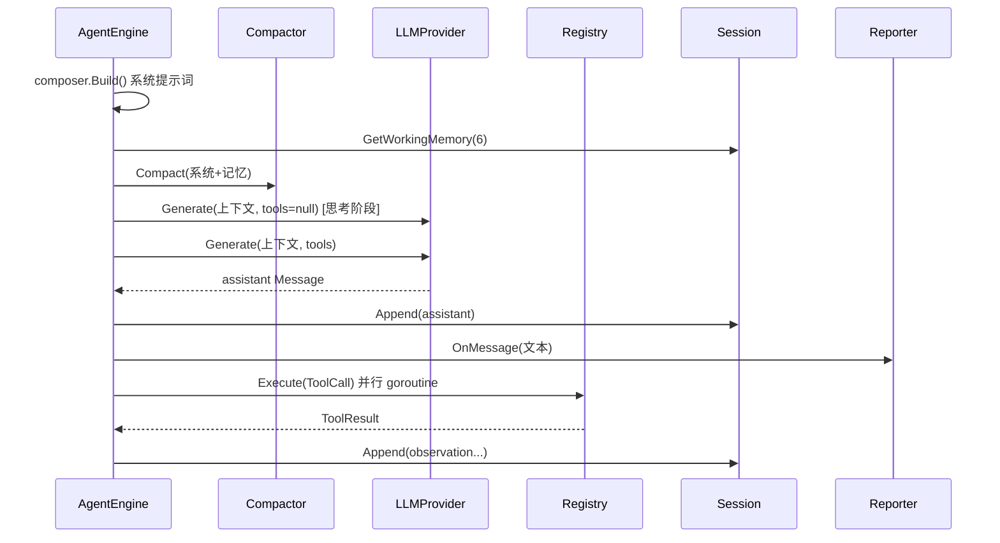

# Engine 引擎模块

`internal/engine` 是 go-my-harness 的**核心执行引擎**：`AgentEngine` 驱动 思考→行动→工具执行 的 Agent 主循环；`Session`/`SessionManager` 承担上下文承载与多端物理隔离；`Reporter` 接口抽象输出层，`TerminalReporter` 是终端实现。

## Component Constraint Index

| Component | Constraints | Risks | Summary |
|-----------|-------------|-------|---------|
| [AgentEngine](../../../internal/engine/loop.go).Run | 6 | 3 | 主循环：压缩→思考→行动→并行工具→回填 |
| [Session](../../../internal/engine/session.go).GetWorkingMemory | 4 | 2 | 最近 N 条工作记忆 + 孤儿工具结果剔除 |
| [Session](../../../internal/engine/session.go).Append | 2 | 0 | 线程安全追加历史（预留 JSONL 持久化点） |
| [SessionManager](../../../internal/engine/session.go).GetOrCreate | 2 | 1 | 全局会话工厂，按 ID 复用 |
| [TerminalReporter](../../../internal/engine/terminal_repoter.go) | 4 | 0 | 终端格式化输出（含截断） |
| [Reporter](../../../internal/engine/reporter.go) | 1 | 1 | 输出抽象接口（thinking/tool/message） |

## Architecture Overview

引擎本身**不持有任何状态**，上下文全部由外部传入的 `Session` 承载——这是多端（CLI / 飞书）并发物理隔离的关键设计：每个会话绑定自己的工作区与历史，引擎实例可被多会话共享。

## Component Responsibilities

### AgentEngine — 核心引擎

`AgentEngine` 组合了 provider、registry、composer、compactor 四个依赖，`Run(ctx, session, reporter)` 执行 Agent 主循环：

1. **系统提示词重建**：用 `session.WorkDir` 动态重建 composer 并 `Build()` 系统提示词（PlanMode 由引擎开关决定）；
2. **工作记忆截取**：`session.GetWorkingMemory(6)` 取最近 6 条作为短期记忆，拼上系统提示词形成待发送上下文；
3. **压缩防线**：上下文先经 `compactor.Compact` 双重降级压缩（掩码+头尾截断），防止超长工具输出撑爆模型窗口；
4. **Phase 1 思考（可选）**：`EnableThinking=true` 时先做一次不带工具的无 tool 推理，思考文本追加回会话与上下文；
5. **Phase 2 行动**：带工具列表再次推理，assistant 回复（文本+工具调用）追加回会话；无工具调用则 `break` 退出循环；
6. **并行工具执行**：对每个 `ToolCall` 开启独立 goroutine 执行，`WaitGroup` 等待全部完成，结果以 `RoleUser + ToolCallID` 观察消息回填会话，进入下一轮循环。

### Session — 会话承载

`Session` 持有 `ID`、`WorkDir`、时间戳与 `history []schema.Message`，用读写锁保证并发安全：

- `Append`：线程安全追加消息，更新 `UpdatedAt`；预留了 JSONL 持久化点（生产级实现会将历史落盘到 `.claw/sessions/`）；
- `GetWorkingMemory`：**驾驭工程核心**——只取最近 N 条消息形成短期工作记忆；若截断后的首条是“孤儿”工具响应（`RoleUser` 且带 `ToolCallID`，其触发 [ToolCall](../../../internal/schema/message.go) 已被截掉），必须强行丢弃顺延，否则大模型 API 会因消息连续性被破坏而返回 400。

### SessionManager — 全局会话工厂

`GlobalSessionMgr` 是包级全局单例，`GetOrCreate(id, workDir)` 按 ID 复用既有会话、否则新建。飞书场景以 `chatId` 作会话 ID，实现不同群聊物理隔离。

### Reporter / TerminalReporter — 输出抽象

`Reporter` 接口定义四类回调：`OnThinking`（慢思考开始）、`OnToolCall`（调用工具）、`OnToolResult`（工具结果）、`OnMessage`（最终回答）。`TerminalReporter` 以 emoji 图标在终端渲染状态，工具参数超过 150 字符时截断显示。

## Data Flow

## API Contracts

- `NewAgentEngine(p provider.LLMProvider, r tools.Registry, enableThinking bool, planMode bool) *AgentEngine`
- `(*AgentEngine).Run(ctx context.Context, session *Session, reporter Reporter) error` — 崩溃返回 error
- `NewSession(id string, workDir string) *Session`；`(*Session).Append(msgs ...schema.Message)`；`(*Session).GetWorkingMemory(limit int) []schema.Message`
- `var GlobalSessionMgr *SessionManager`；`(*SessionManager).GetOrCreate(id string, workDir string) *Session`
- `NewTerminalReporter() *TerminalReporter`（实现 `engine.Reporter`）

## Cross-References

- **provider 模块**：`AgentEngine` 通过 `LLMProvider.Generate` 发请求，思考阶段传 `nil` 工具、行动阶段传工具列表；
- **tools 模块**：`Registry.GetAvailableTools` 取工具定义、`Registry.Execute` 路由执行；
- **context 模块**：`PromptComposer.Build` 生成系统提示词、`Compactor.Compact` 压缩上下文；
- **feishu 模块**：`FeishuBot.handleAgentRun` 用 chatId 建会话并调用 `engine.Run`；
- **app 模块**：CLI 入口创建引擎（thinking=false, planMode=true）并唤醒固定会话。

## Architecture Decisions

1. **无状态引擎 + 外部化会话**：[AgentEngine](../../../internal/engine/loop.go) 不保存历史，全部状态在 [Session](../../../internal/engine/session.go)，使单一引擎实例可服务多端并发会话；
2. **工作记忆窗口（6 条）**：只送最近 N 条而非全量历史，配合 [Compactor](../../../internal/context/compactor.go) 双保险控制上下文成本；
3. **孤儿工具结果剔除**：在切片层保证消息连续性，规避大模型 API 的 400 报错，属于“面向 API 契约的防御性设计”；
4. **工具并行执行**：多个工具调用并发跑 goroutine，显著缩短多步操作的总时延；
5. **[Reporter](../../../internal/engine/reporter.go) 解耦展现层**：终端/飞书/未来 WebUI 通过接口接入，引擎不感知具体输出通道。

## Constraints and Edge Cases

- 会话历史仅存内存，进程重启即丢失（仅靠 PlanMode 的 PLAN.md/TODO.md 实现断点续传）；
- 工具并行执行依赖工具自身线程安全（各工具无共享可变状态，当前满足）；
- 思考阶段产物会追加进会话，长期运行会占用历史空间，需依赖 [Compactor](../../../internal/context/compactor.go) 治理；
- `GetWorkingMemory` 的剔除逻辑假设首条孤儿工具响应可安全丢弃，极端场景（全部消息均为孤儿响应）会清空记忆。
