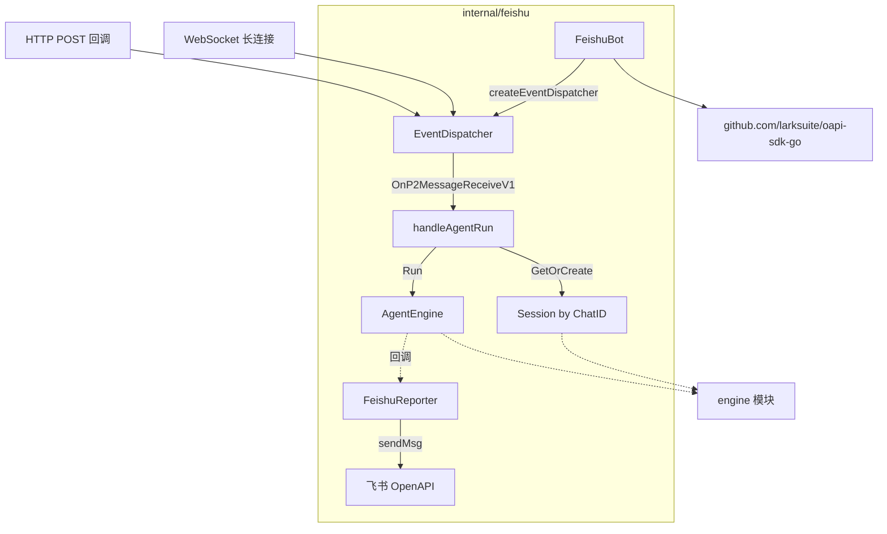
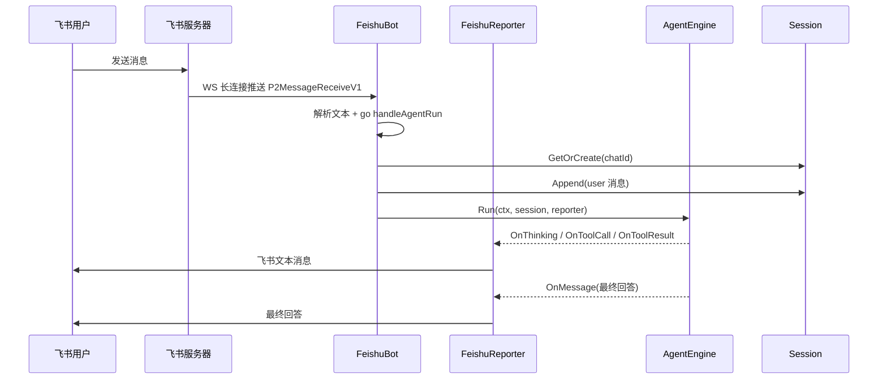

# Feishu 飞书集成模块

`internal/feishu` 将 go-my-harness 的 Agent 能力接入飞书（Lark）开放平台：`FeishuBot` 负责接收消息并触发引擎，`FeishuReporter` 把引擎的各类回调翻译成飞书消息回传用户。它基于 `github.com/larksuite/oapi-sdk-go/v3` 实现，是本仓唯一的外向集成通道。

## Component Constraint Index

| Component | Constraints | Risks | Summary |
|-----------|-------------|-------|---------|
| [FeishuBot](../../../internal/feishu/bot.go).createEventDispatcher | 4 | 2 | 事件订阅：消息接收/已读，POST 与 WS 共用 |
| [FeishuBot](../../../internal/feishu/bot.go).handleAgentRun | 3 | 2 | 桥接层：ChatID 建会话 + 引擎 Run + 崩溃回传 |
| [FeishuBot](../../../internal/feishu/bot.go).StartWebSocket | 3 | 1 | 长连接模式，自动重连，无公网要求 |
| [FeishuReporter](../../../internal/feishu/bot.go).sendMsg | 2 | 1 | 飞书 OpenAPI 文本消息发送 |
| [FeishuReporter](../../../internal/feishu/bot.go).OnToolResult | 2 | 0 | 成功仅回执、失败回传详情 |

## Architecture Overview

模块提供两种事件接入方式：**WebSocket 长连接**（推荐，无需公网 IP、自动重连）与 **HTTP 回调**（需公网 IP 与回调 URL）。两种方式共用同一个 `createEventDispatcher` 构建的事件调度器。

## Component Responsibilities

### FeishuBot — 机器人封装

`FeishuBot` 持有飞书客户端、四要素凭证（appID/appSecret/encryptKey/verifyToken）与核心引擎引用、工作区路径：

- `NewFeishuBot(eng, cfg, workDir)`：app_id/app_secret 缺失时 `log.Fatal` 直接退出；
- `StartWebSocket(ctx)`：创建 `ws.NewClient`（启用自动重连、Info 日志级别），阻塞式 `Start` 长连接；长连接模式 verifyToken/encryptKey 传空；
- `GetEventDispatcher()`：供 HTTP 服务器挂载 POST 回调，传完整 verifyToken/encryptKey；
- `createEventDispatcher`：订阅 `P2MessageReceiveV1`（收到消息）与 `P2MessageReadV1`（已读，静默忽略）。收到消息时**粗略解析文本**——去掉 `{"text":"` 前缀与 `"}` 后缀，提取 contentStr；随后**绝不在回调内阻塞**，开启独立 goroutine 跑 `handleAgentRun`。

### handleAgentRun — 桥接层

将飞书消息转化为引擎调用：

1. 为当前聊天窗口创建专属 `FeishuReporter`（绑定 client 与 chatId）；
2. 以 **ChatID 作为 SessionID** 从 `GlobalSessionMgr` 取会话——不同群聊/私聊各自独立 [Session](../../../internal/engine/session.go)，互不干扰；
3. 将消息文本以 `RoleUser` 追加进会话；
4. 调用 `b.engine.Run` 执行 Agent；失败时通过 reporter 回传“❌ Agent 运行崩溃”提示。

### FeishuReporter — 飞书输出端

实现 `engine.Reporter` 接口，将引擎回调翻译为飞书文本消息（编译期以 `var _ engine.Reporter = (*FeishuReporter)(nil)` 强制校验）：

- `sendMsg`：构造 `{text: ...}` JSON，调用 `Im.Message.Create` 发送到 chatId；
- `OnThinking`：仅发轻量提示“🤔 模型正在慢思考”防刷屏；
- `OnToolCall`：发送工具名与参数；
- `OnToolResult`：成功仅回执“✅ 执行成功”，失败回传“⚠️ 执行报错 + 详情”——刻意避免刷屏；
- `OnMessage`：透传最终回答。

## Data Flow

## API Contracts

- 入向：飞书事件系统（WebSocket 长连接或 HTTP POST 回调），事件类型 `im.message.receive_v1`；
- 出向：飞书 OpenAPI `POST /open-apis/im/v1/messages?receive_id_type=chat_id`（`Im.Message.Create`）；
- 凭证：`config.json` 的 `feishu` 节（app_id / app_secret / encrypt_key / verify_token）；
- 会话契约：以飞书 ChatID 为 SessionID，引擎共享同一 `GlobalSessionMgr`。

## Cross-References

- **engine 模块**：`GlobalSessionMgr.GetOrCreate`、`AgentEngine.Run`、`Reporter` 接口；
- **provider 模块**：`provider.FeishuConfig` 提供机器人凭证；
- **schema 模块**：构造 `RoleUser` 消息；
- **app 模块**：飞书模式与 CLI 模式共用引擎与会话体系（当前代码未提供飞书模式入口，`FeishuBot` 为待接入组件）。

## Architecture Decisions

1. **长连接优先**：WebSocket 模式免公网 IP、免回调 URL、SDK 自动重连，部署成本最低；
2. **回调不阻塞**：收到消息立即开 goroutine，避免飞书回调超时重试导致消息重复处理；
3. **ChatID 即会话 ID**：天然实现多群聊/私聊的物理隔离，无需额外会话路由表；
4. **防刷屏设计**：成功类回调仅回执、思考仅轻提示，避免工具链长跑时消息轰炸。

## Constraints and Edge Cases

- 消息文本解析为**粗略字符串处理**（TrimPrefix/TrimSuffix），非富文本/卡片消息会被截断误读；
- goroutine 无并发上限控制，高频群聊可能瞬时拉起大量 Agent 任务；
- `sendMsg` 忽略飞书 API 返回错误（`_` 丢弃），发送失败无告警；
- 飞书凭证缺失时 `log.Fatal` 硬退出，需在 config.json 配齐后才可启动。
