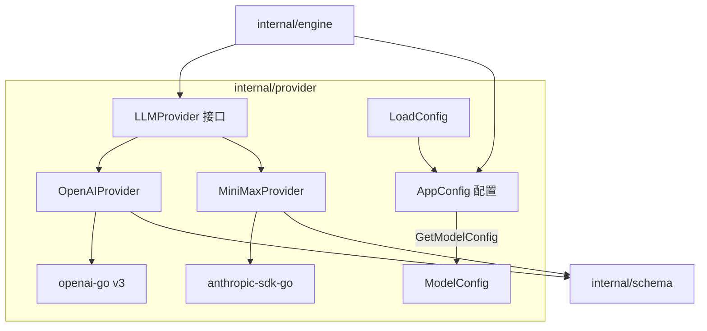
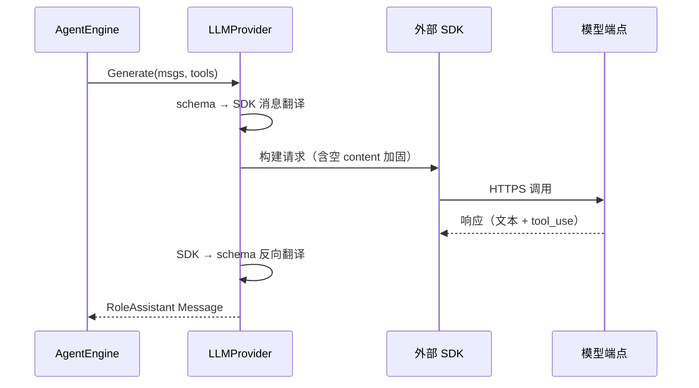

# Provider 模型提供商模块

`internal/provider` 定义与大模型通信的统一契约，并提供两套适配器实现：`OpenAIProvider`（基于 `openai-go v3`，面向 DeepSeek / 智谱等 OpenAI 兼容端点）与 `MiniMaxProvider`（基于 `anthropic-sdk-go`，面向 MiniMax Claude Format API）。`config.go` 负责 `config.json` 的加载与模型选择。

## Component Constraint Index

| Component | Constraints | Risks | Summary |
|-----------|-------------|-------|---------|
| [MiniMaxProvider](../../../internal/provider/claude.go).Generate | 6 | 3 | schema↔Anthropic 双向翻译 + 空 content 加固 |
| [OpenAIProvider](../../../internal/provider/openpi.go).Generate | 6 | 3 | schema↔OpenAI 双向翻译 + 空 content 加固 |
| LoadConfig | 3 | 1 | 相对/绝对路径解析 + 必填项校验 |
| GetModelConfig | 2 | 1 | 默认模型回退与未定义报错 |
| LLMProvider | 1 | 1 | 统一推理契约（上下文+工具→回复） |

## Architecture Overview



核心设计是**适配器模式 + 双层 SDK**：上层只依赖 `LLMProvider` 接口，通过 `config.json` 的 `provider` 字段在运行时切换两套 SDK，实现“一套引擎，多家模型”的供应商中立架构。

## Component Responsibilities

### LLMProvider — 统一契约

```go
Generate(ctx context.Context, messages []schema.Message, availableTools []schema.ToolDefinition) (*schema.Message, error)
```

接收当前上下文历史与可用工具列表，返回一条 `RoleAssistant` 消息。思考阶段传 `availableTools=nil`（无工具推理），行动阶段传全量工具。

### OpenAIProvider — OpenAI 兼容适配器

`Generate` 四步流程：

1. **消息翻译**：`RoleSystem` → `SystemMessage`；`RoleUser` 带 `ToolCallID` → `ToolMessage(content, toolCallID)`（v3 参数顺序是 content 在前），否则 `UserMessage`；`RoleAssistant` → `ChatCompletionAssistantMessageParam`；
2. **空 content 加固**：assistant 携带 tool_calls 但 content 为空时，**必须显式传 `""` 字段**——严格的兼容端点（DeepSeek/智谱）会报 400 参数非法；
3. **工具翻译**：`ToolDefinition.InputSchema` 先直接断言 `map[string]interface{}`，失败则 JSON 往返序列化到 `shared.FunctionParameters`，再以 `ChatCompletionFunctionTool` 挂载；工具非空时才挂 `Tools`（慢思考机制支撑）；
4. **反向解析**：从 `Choices[0]` 提取 content 与 function 类型 tool_calls，包装为内部 `schema.Message`。空 Choices 直接报错。

### MiniMaxProvider — Anthropic 兼容适配器

`NewAnthropicProvider(apiKey, baseURL, model)` 是通用构造函数（baseURL 指向 MiniMax Claude Format API）。`Generate` 流程：

1. **消息翻译**：`RoleSystem` 提取为 `params.System`；`RoleUser` 带 `ToolCallID` → `NewToolResultBlock(id, content, false)`，否则 `NewTextBlock`；`RoleAssistant` 将文本块与 `ToolUseBlockParam`（从 `tc.Arguments` JSON 反序列化）混合成 blocks，**content 为空但有 tool_calls 时补空文本块**；
2. **工具翻译**：从 `InputSchema` 提取 `properties` / `required` 填充 `ToolInputSchemaParam`；
3. **请求**：`MaxTokens: 4096`，system 非空时挂 System，tools 非空时挂 Tools；
4. **反向解析**：按 block 类型聚合 text 与 tool_use，`block.Input` JSON 序列化回 `Arguments`。

### config.go — 配置加载

- `AppConfig`：`default_model` + `models` 映射 + 可选 `feishu` 节；`ModelConfig` 含 `api_key` / `base_url` / `provider`；
- `LoadConfig`：相对路径先按当前目录、再按可执行文件目录解析；解析后强制校验 `default_model` 非空与 `models` 非空；
- `GetModelConfig(name)`：name 为空回退默认模型，未定义则报错。

## Data Flow



## API Contracts

- `NewOpenAIProvider(apiKey, baseURL, model string) *OpenAIProvider`
- `NewAnthropicProvider(apiKey, baseURL, model string) *MiniMaxProvider`
- `LoadConfig(configPath string) (*AppConfig, error)`
- `(*AppConfig).GetModelConfig(name string) (*ModelConfig, string, error)`
- config.json 结构：`{default_model, models: {<name>: {api_key, base_url, provider}}, feishu: {...}}`

## Cross-References

- **engine 模块**：`AgentEngine` 持 `LLMProvider` 引用，思考/行动两阶段调用 `Generate`；
- **schema 模块**：消息与工具定义的翻译源/目标类型；
- **app 模块**：CLI 按 `mc.Provider` 分流创建适配器；
- **feishu 模块**：`provider.FeishuConfig` 承载机器人凭证。

## Architecture Decisions

1. **适配器隔离 SDK**：引擎与 schema 不感知具体 SDK，新增模型供应商只需实现 `LLMProvider`；
2. **空 content 显式化**：两个适配器都对“空 content + tool_calls”做加固，规避严格兼容端点的 400 坑，属于踩坑沉淀；
3. **配置驱动模型切换**：运行时读 `config.json` 决定适配器，无需改代码换模型；
4. **InputSchema 弱类型桥接**：`interface{}` 在适配器层收敛为各 SDK 强类型，契约层保持中立。

## Constraints and Edge Cases

- `OpenAIProvider` 依赖 `openai-go v3`，其 `ToolMessage` 参数顺序（content, toolCallID）与旧版不同，升级 SDK 需复核；
- `MiniMaxProvider` 的 tool_use 入参经 `json.Unmarshal` 到 `map[string]interface{}`，复杂嵌套 schema 可能丢失类型信息；
- `MaxTokens` 固定 4096，无配置化出口；
- 网络失败只包装错误返回，无重试/退避策略，需上层自行处理。
