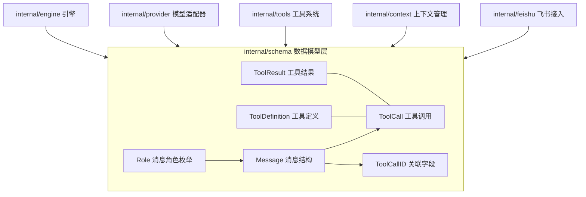
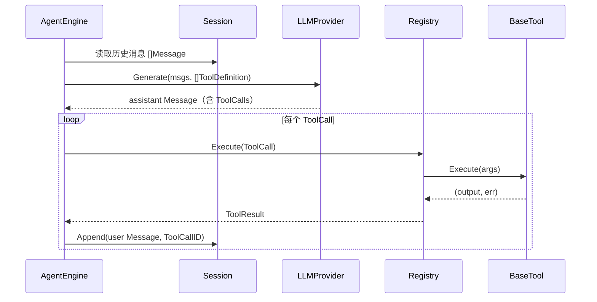

# Schema 数据模型模块

`internal/schema` 是整个 go-my-harness 的**共享消息契约层**，位于系统最底部，被所有上层模块（engine、provider、tools、feishu、context）共同依赖，自身不依赖任何业务模块。它定义了 Agent 生命周期内所有跨组件传递的数据结构，使引擎主循环、大模型提供商适配器与本地工具系统能够在统一的类型系统下协作。

## Component Constraint Index

| Component | Constraints | Risks | Summary |
|-----------|-------------|-------|---------|
| [Message](../../../internal/schema/message.go) | 2 | 1 | Role+ToolCalls+ToolCallID 组合决定 API 翻译语义 |
| [ToolCall](../../../internal/schema/message.go) | 1 | 1 | Arguments 延迟解析，由具体工具消费 |
| [ToolResult](../../../internal/schema/message.go) | 1 | 0 | IsError 驱动错误自愈回路 |

## Architecture Overview



设计上采用**纯数据结构 + 零依赖**策略：schema 包不引入任何第三方 SDK，全部类型仅依赖标准库 `encoding/json`。这使得它成为唯一能同时被 Anthropic SDK 适配器与 OpenAI SDK 适配器安全引用的包，充当两套外部 SDK 之间的翻译枢纽。

## Component Responsibilities

### Role 角色枚举

`Role` 是字符串别名类型，定义了消息的三类角色：

- `RoleSystem`（`system`）：系统提示词，确立 Agent 的性格与红线，通常位于对话开头；
- `RoleUser`（`user`）：用户输入，以及工具执行后的返回结果（Observation）；
- `RoleAssistant`（`assistant`）：模型的输出，可能包含推理文本（Reasoning）或工具调用（[ToolCall](../../../internal/schema/message.go)）。

角色体系是 Agent 对话协议的基石，provider 适配器依据该字段决定消息在外部 SDK 中的映射方式。

### Message 消息结构

`Message` 是上下文中传递的单条消息，包含四个字段：

| 字段 | 类型 | 说明 |
|------|------|------|
| `Role` | `Role` | 消息角色（system / user / assistant） |
| `Content` | `string` | 纯文本内容；assistant 带工具调用时可为空 |
| `ToolCalls` | `[]ToolCall` | 模型请求调用的工具列表，支持一次并行调用多个工具 |
| `ToolCallID` | `string` | 若本条消息是对某次工具调用的响应（Observation），必须填写以关联上下文 |

`ToolCalls` 与 `ToolCallID` 两个字段的语义组合决定了消息在 LLM API 往返中的角色转换：用户消息携带 `ToolCallID` 时会被翻译为工具结果消息，assistant 消息携带 `ToolCalls` 时会被翻译为工具调用消息。

### ToolCall 工具调用

`ToolCall` 表示模型请求调用某个具体工具的指令：

| 字段 | 类型 | 说明 |
|------|------|------|
| `ID` | `string` | 工具调用的唯一 ID，用于将结果回填给模型 |
| `Name` | `string` | 工具名称（如 `bash`、`read_file`） |
| `Arguments` | `json.RawMessage` | JSON 参数，**延迟解析**——将解析责任交给具体工具 |

使用 `json.RawMessage` 保存参数是关键设计决策：工具系统在解析参数失败时可以直接把错误反馈给模型，让模型自行纠正 JSON 格式，而不是在契约层预先强约束。

### ToolResult 工具结果

`ToolResult` 代表工具在本地执行完毕后的物理结果：

| 字段 | 类型 | 说明 |
|------|------|------|
| `ToolCallID` | `string` | 关联的工具调用 ID |
| `Output` | `string` | 工具执行的控制台输出或报错堆栈 |
| `IsError` | `bool` | 标记是否失败，供错误自愈机制参考 |

`IsError` 字段为 Agent 的自纠错能力提供数据支撑：错误输出同样通过消息通道返回给模型，模型据此自行分析并修正。

### ToolDefinition 工具定义

`ToolDefinition` 描述了大模型可以调用的工具元信息，供模型理解工具有什么用、如何传参：

| 字段 | 类型 | 说明 |
|------|------|------|
| `Name` | `string` | 工具名称 |
| `Description` | `string` | 工具用途描述，注入模型上下文 |
| `InputSchema` | `interface{}` | JSON Schema 格式的参数约束 |

`InputSchema` 使用 `interface{}` 保持与各 SDK 的灵活性，provider 适配器负责将其转换为 Anthropic/OpenAI 各自期望的强类型 schema 结构。

## Data Flow



消息在引擎循环中的流转路径：[Session](../../../internal/engine/session.go) 保存历史 → Provider 翻译为外部 API 消息 → 返回 assistant 消息 → 引擎解析 ToolCalls → [Registry](../../../internal/tools/registry.go) 路由执行 → 以 user 角色 + ToolCallID 回填上下文 → 进入下一轮循环。

## API Contracts

本模块不暴露网络 API，但定义了整个系统的**类型级契约**，各模块间传递的 JSON 序列化格式如下：

```json
{
  "role": "assistant",
  "content": "",
  "tool_calls": [
    {"id": "toolu_01", "name": "bash", "arguments": "{\"command\":\"ls\"}"}
  ]
}
```

```json
{
  "tool_call_id": "toolu_01",
  "output": "main.go\nserver.go\n",
  "is_error": false
}
```

兼容性约束：`Role` 取值固定为 `system` / `user` / `assistant` 三值，新增角色需同步修改所有 provider 适配器的消息翻译逻辑；`ToolCall.Arguments` 与 `ToolDefinition.InputSchema` 的 JSON 结构保持弱类型，由消费者自行解析。

## Cross-References

- **engine 模块**：`AgentEngine.Run` 消费 `Message`、`ToolCall`、`ToolResult`，是 schema 类型的最大消费者；`Session` 存储 `[]Message` 历史。
- **provider 模块**：`MiniMaxProvider` / `OpenAIProvider` 将 schema 消息翻译为 Anthropic / OpenAI SDK 消息，并将响应翻译回 schema 消息；同时把 `ToolDefinition` 转换为各 SDK 的工具 schema。
- **tools 模块**：`BaseTool.Definition()` 返回 `ToolDefinition`，`Execute` 接收 `json.RawMessage` 参数、经 [Registry](../../../internal/tools/registry.go) 封装为 `ToolResult`。
- **feishu 模块**：`FeishuBot.handleAgentRun` 构造 `schema.Message{Role: RoleUser, Content: prompt}` 并追加到 [Session](../../../internal/engine/session.go)。
- **context 模块**：`PromptComposer.Build` 组合 system / user 消息，`Compactor` 压缩历史消息列表。

## Architecture Decisions

1. **纯数据结构、零外部依赖**：schema 包仅依赖标准库，避免把任何 SDK 类型泄漏到契约层，是双层适配（Anthropic + OpenAI）得以成立的前提。
2. **`Arguments` 用 `json.RawMessage` 延迟解析**：把 JSON 解析责任下放到具体工具，解析失败时错误信息可直接返回给模型形成自愈回路。
3. **`ToolCallID` 承载观察回填语义**：不引入额外的消息子类型，仅通过 `Role=user` + `ToolCallID` 的组合表达“这是工具结果”，保持类型面最小。
4. **`InputSchema` 保持 `interface{}`**：兼容 Anthropic `ToolInputSchemaParam` 与 OpenAI `FunctionParameters` 两套强类型 schema 结构，由适配器在翻译时做转换，避免契约层绑定单一 SDK。

## Constraints and Edge Cases

- assistant 消息携带 `tool_calls` 但 `Content` 为空时，Anthropic / OpenAI 兼容端点可能拒绝消息，provider 适配器需补空文本块（详见 provider 模块文档）；
- `ToolResult.Output` 长度不受 schema 层约束，截断保护由具体工具实现（如 bash/read_file 的 8000 字节上限）；
- `Role` 角色枚举是封闭集合，扩展角色类型属于破坏性变更，需同步升级所有适配器。
