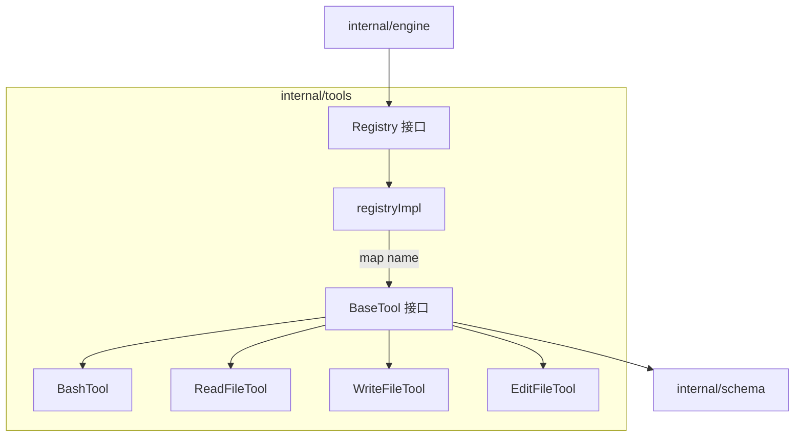
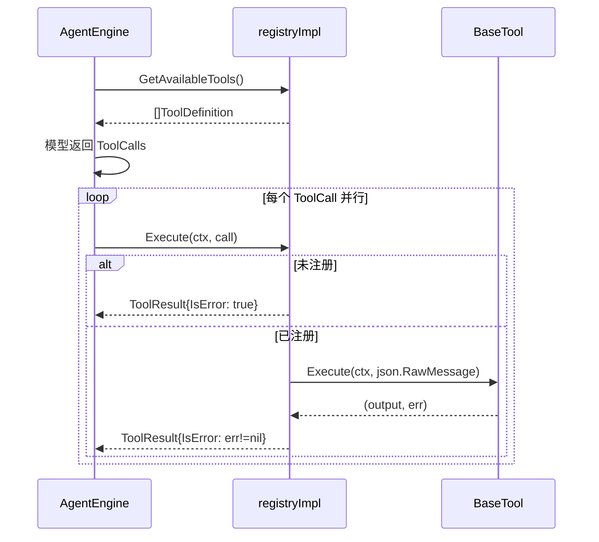

# Tools 工具系统模块

`internal/tools` 是 Agent 的**行动能力层**：`Registry` 提供工具的注册、路由与执行框架；四个具体工具（`read_file` / `write_file` / `edit_file` / `bash`）让 Agent 能够读写文件、编辑代码、执行命令，全部锁定在注入的 `workDir` 内。

## Component Constraint Index

| Component | Constraints | Risks | Summary |
|-----------|-------------|-------|---------|
| registryImpl.Execute | 3 | 1 | 名称路由 + 幻觉检测 + 结果封装 |
| [BashTool](../../../internal/tools/bash.go).Execute | 4 | 3 | 超时/工作区绑定/错误回传/截断 |
| [EditFileTool](../../../internal/tools/edit_file.go).Execute | 3 | 2 | 读-改-写 + 四级模糊匹配 |
| fuzzyReplace | 4 | 2 | 精确→换行符→trim→逐行降级 |
| [ReadFileTool](../../../internal/tools/read_file.go).Execute | 2 | 1 | 路径拼接 + 8000 字节截断 |
| [WriteFileTool](../../../internal/tools/write_file.go).Execute | 2 | 1 | MkdirAll + 0644 写盘 |
| registryImpl.Register | 1 | 0 | 同名覆盖告警 |

## Architecture Overview

框架层（[Registry](../../../internal/tools/registry.go)）与实现层（具体工具）分离：`BaseTool` 接口定义 `Name` / `Definition` / `Execute`，`registryImpl` 以 `map[string]BaseTool` 实现 O(1) 路由；引擎只面向 `Registry` 接口编程。

## Component Responsibilities

### registryImpl — 注册与路由框架

- `Register`：按 Name 挂载，同名覆盖并告警；
- `GetAvailableTools`：汇总所有工具的 `Definition()` 返回 `[]schema.ToolDefinition` 供模型调用；
- `Execute`：路由查找——工具不存在说明模型幻觉，直接返回 `IsError=true` 的 [ToolResult](../../../internal/schema/message.go) 让模型自纠；执行出错同样封装为 `IsError=true`，不向引擎抛 Go error。

### ReadFileTool — 读取文件

`Definition` 描述 `path` 参数（相对工作区）。`Execute`：延迟解析 JSON 参数 → `filepath.Join(workDir, path)` 拼绝对路径 → `os.Open` + `io.ReadAll` → **8000 字节物理截断**防 OOM（注释明确提示生产环境需补路径穿越检测）。

### WriteFileTool — 写入文件

`Definition` 描述 `path` + `content`。`Execute`：解析参数 → Join 到 workDir（防修改系统级文件）→ `MkdirAll` 自动建父目录 → `WriteFile(0644)`。

### EditFileTool — 编辑文件

`Definition` 描述 `path` + `old_text` + `new_text`（强调 old_text 需足够上下文保证唯一）。`Execute` 读-改-写三步，核心在 `fuzzyReplace` 的**四级模糊匹配降级链**：

1. **L1 精确匹配**：唯一则替换，多匹配报错要求更多上下文；
2. **L2 统一换行符**：`\r\n` → `\n` 后重试（跨平台）；
3. **L3 去首尾空白**：trim 后重试；
4. **L4 逐行去空格匹配**：`lineByLineReplace` 按行 trim 对比，仍要求唯一匹配，否则报错引导模型先 `read_file` 确认内容。

### BashTool — 执行命令

`Definition` 描述 `command` 参数（支持 `&&` 链式）。`Execute` 包含**四条驾驭底线**：

1. **时间预算**：`context.WithTimeout(30s)`，超时返回“已被系统强制终止”警告；
2. **工作区绑定**：`cmd.Dir = workDir`；
3. **错误自愈回传**：命令报错不返回 Go error，而是拼接“执行报错 + 输出”字符串返回，交给模型自纠；
4. **长度截断**：输出超 8000 字节截断。另按 `runtime.GOOS` 分流：Windows 用 `powershell -NoProfile -NonInteractive`，其他平台用 `bash -c`。

## Data Flow

## API Contracts

- `NewRegistry() Registry`；`Register(tool BaseTool)`；`GetAvailableTools() []schema.ToolDefinition`；`Execute(ctx, call schema.ToolCall) schema.ToolResult`
- `BaseTool` 接口：`Name() string` / `Definition() schema.ToolDefinition` / `Execute(ctx, args json.RawMessage) (string, error)`
- 工具构造：`NewReadFileTool(workDir)` / `NewWriteFileTool(workDir)` / `NewEditFileTool(workDir)` / `NewBashTool(workDir)`
- 工具名常量：`read_file` / `write_file` / `edit_file` / `bash`

## Cross-References

- **engine 模块**：`AgentEngine` 用 `Registry.GetAvailableTools` 取工具定义、`Registry.Execute` 并行执行 [ToolCall](../../../internal/schema/message.go)；
- **schema 模块**：`ToolDefinition` 描述工具、`ToolCall` 携带参数、`ToolResult` 封装结果；
- **context 模块**：PlanMode 规范引导 Agent 使用 `write_file` 创建 PLAN.md/TODO.md 并用 `edit_file` 打勾；
- **app 模块**：CLI 入口注册四件套，工作区锁定项目根目录。

## Architecture Decisions

1. **错误即信息**：工具执行错误一律转字符串回传模型，驱动自愈回路而非中断主循环；
2. **工作区沙箱**：所有工具以 `filepath.Join(workDir, path)` 约束读写范围，防路径穿越；
3. **延迟参数解析**：`json.RawMessage` 由具体工具解析，解析失败信息直接反馈模型；
4. **模糊匹配降级**：编辑工具从精确到模糊四级降级，最大化替换成功率同时保证唯一性；
5. **资源边界内置**：bash 超时 30s、输出截断 8000 字节，防止模型失控消耗资源。

## Constraints and Edge Cases

- 路径穿越检测仅为注释提示，`../../` 前缀可逃逸 workDir，生产环境必须补 `filepath.Clean` 校验；
- Windows 下 bash 工具实际调用 PowerShell，`&&` 链式在 PS 5.1 下行为可能不同；
- `edit_file` 模糊匹配 L4 以“行内 trim 后相等”为准，相同代码块多处出现时只能靠上下文区分；
- 无输出时 bash 返回固定提示“命令执行成功，无终端输出”，长驻服务（top/watch）会触发 30s 超时终止。
