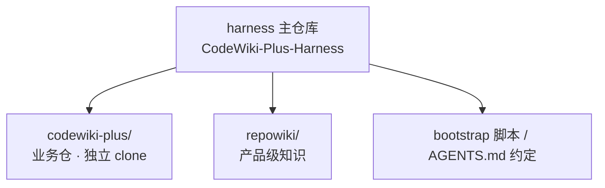

# 产品概述

## 产品定位

CodeWiki-Plus 是从代码仓库自动生成 LLM 可检索 Wiki 文档的 Python/MCP 工具链：解析源码与对话，产出结构化模块/实体/概念文档，并提供 ingest_note / query_wiki 等知识管理工具，融合 team-memory（对话 → Wiki 经验沉淀）能力。

<!-- TODO: 在此补充产品路线、目标用户、当前版本等 -->

## Harness 工作区结构

本仓（harness 主仓库）与业务仓的关系是"目录父子、git 隔离"：

设计原则（详见仓库根 README 与 AGENTS.md）：

1. harness 不入业务仓——跨仓脚手架只存在于本仓
2. 提交不打架——业务仓目录被本仓 `.gitignore` 排除，物理上无法串仓提交
3. 分支松耦合——各业务仓自由选择分支策略，本仓分支固定变动不频繁
4. 知识分层——本仓 repowiki 存产品概述与导航，深度知识在业务仓自己的 repowiki

## 跨仓检索方式

- 产品级知识：`query_wiki(output_dir=<harness根>/repowiki)`
- 业务仓深度知识：`query_wiki(output_dir=<harness根>/codewiki-plus/repowiki)`
- 跨服务调用关系：`query_cross_service(workspace_path=<harness根目录>)`
